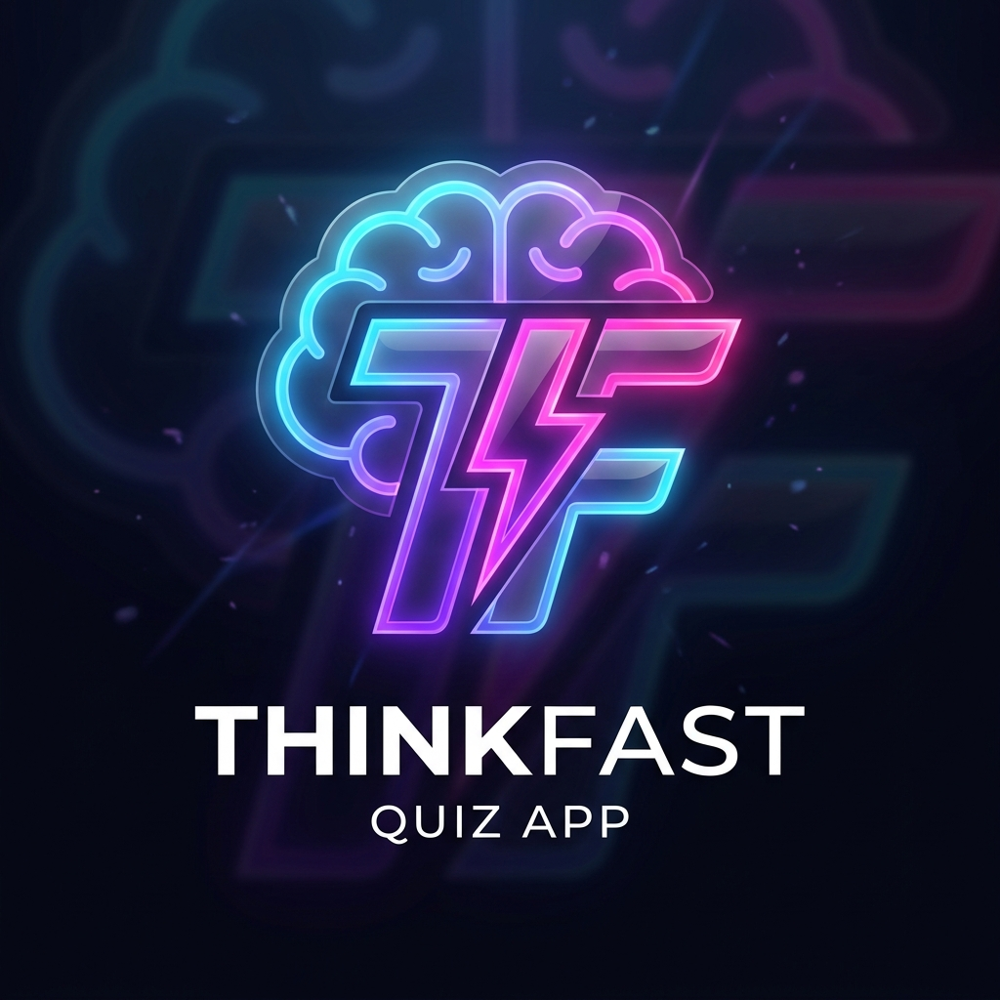

  
  <h1>ThinkFast: The Ultimate Programming Quiz</h1>
  
<strong>Think fast, act faster. Prove your coding knowledge against the clock.</strong>

  
  
  

---

## 🎯 What is ThinkFast?

**ThinkFast** is not just another quiz app—it is a premium, high-pressure environment designed to test how well you *really* know programming. Whether you are a beginner looking to solidify your fundamentals or an expert looking for a challenge, ThinkFast forces you to recall information instantly. 

With exactly **15 seconds on the clock per question**, there is no time to Google. You either know it, or you don't.

## 🎮 How to Play

1. **Choose Your Domain**: From the main dashboard, search or browse through a variety of technical domains ranging from foundational web technologies to heavy-duty systems programming languages.
2. **Beat the Clock**: Once you start, you have 15 seconds to answer each question. If the timer hits zero, it counts as an incorrect answer and you are immediately moved to the next question!
3. **Set High Scores**: Your highest scores are recorded directly in your browser. Strive to get a perfect 5/5 on every single category.

## 🧠 Available Domains

ThinkFast currently features hand-crafted questions across the following technical domains:
- **HTML & CSS**: The structural and visual foundation of the web.
- **JavaScript & React**: The logic of the web and modern UI engineering.
- **Python**: General-purpose scripting and data structures.
- **Java**: Object-oriented principles and enterprise systems.
- **C++**: Systems programming and memory management.
- **Go**: Concurrent programming and modern backend architecture.
- **Ruby**: Expressive scripting and web frameworks.

## 💎 Design Philosophy

ThinkFast was designed to look and feel incredible. We stepped away from boring, static white-background forms and instead built a deeply interactive experience:
- **Glassmorphism**: A sleek, frosted-glass interface that feels modern and premium.
- **Interactive Environment**: The home dashboard features a highly responsive, fluid simulation cursor (`SplashCursor`) that reacts to your every mouse movement.
- **The "Pressure" Aesthetic**: When you enter a quiz, the background shifts into a "Letter Glitch" matrix effect, subtly increasing the tension and making the experience feel uniquely intense.

---

  <i>Designed and developed for speed, knowledge, and aesthetics.</i>

